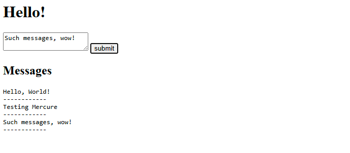

# Issue reproducer

An attempt to reproduce https://github.com/dunglas/symfony-docker/issues/704 issue.



## Configuration
1. Create a `.env.local` file with content
    ```dotenv
    SERVER_NAME=192.168.xx.xx:80
    APP_SECRET=ChangeMe
    CADDY_MERCURE_JWT_SECRET=ChangeThisMercureHubJWTSecretKey
    ```
2. Build the project image
    ```shell
    docker compose -f compose.yaml -f compose.prod.yaml --env-file .env --env-file .env.local build php
    ```
3. Run the project
    ```shell
    docker compose -f compose.yaml -f compose.prod.yaml --env-file .env --env-file .env.local up -d php
    ```

## Usage
1. Open project's _hello_ page `http://192.168.xx.xx/hello`
2. Enter message you line to send in the `<textarea>` field
3. Click to `submit` button

## Expected behaviour

The submitted message will be shown in the _Messages_ section on the same page.
